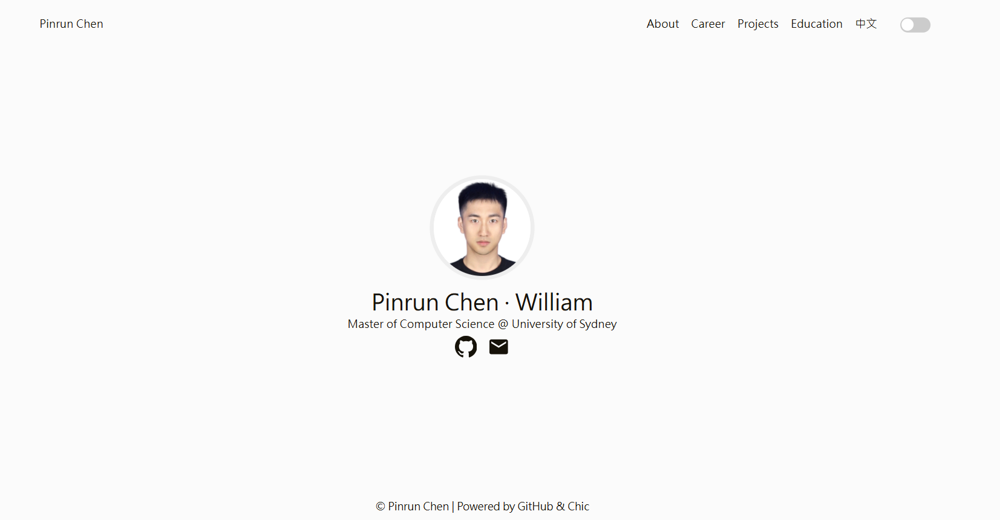

# Pinrun Chen | Personal Homepage

[English](#english) | [中文](#中文)

[](https://william-1225.github.io/)
[](https://william-1225.github.io/)
[](https://github.com/William-1225/William-1225.github.io/commits/main)
[](LICENSE)



## English

This repository hosts my personal homepage, built as a lightweight static site and deployed with GitHub Pages.

**Live site:** [william-1225.github.io](https://william-1225.github.io/)

### Highlights

- Bilingual interface with English as the default language
- Clean hero profile with GitHub and email links
- Career, Projects, and Education sections presented as lightweight timelines
- Dark mode and responsive navigation
- Interactive project report under `report/`

### Sections

- **About**: profile summary and key highlights
- **Career**: internship and professional experience
- **Projects**: featured projects, including the weekly dealer network monitoring report
- **Education**: academic background
- **Report**: interactive project report and data visualization page

### Project Structure

```text
.
|-- index.html
|-- report/
|-- static/
|-- contents/
|-- screenshot_full.png
|-- LICENSE
`-- README.md
```

### Local Preview

```bash
python -m http.server 8000
```

Then open:

```text
http://localhost:8000
```

### Deployment

The site is deployed through GitHub Pages from the `main` branch.

```bash
git add .
git commit -m "Update homepage"
git push origin main
```

### Credits

The site started from a personal homepage template and has since been customized for my own profile, projects, and visual style.

### License

This project is licensed under the [MIT License](LICENSE).

## 中文

这个仓库用于托管我的个人主页。网站是一个轻量级静态页面，通过 GitHub Pages 自动部署。

**在线访问：** [william-1225.github.io](https://william-1225.github.io/)

### 主页特点

- 支持中英文切换，默认展示英文版
- 首屏展示个人头像、简介、GitHub 和邮箱入口
- Career、Projects、Education 使用轻量时间线布局
- 支持深色模式和响应式导航
- `report/` 目录下包含项目报告和可视化页面

### 页面板块

- **About**：个人简介和核心信息
- **Career**：实习与职业经历
- **Projects**：项目经历，包括竞对渠道监测周度报告
- **Education**：教育背景
- **Report**：交互式项目报告与数据可视化页面

### 项目结构

```text
.
|-- index.html
|-- report/
|-- static/
|-- contents/
|-- screenshot_full.png
|-- LICENSE
`-- README.md
```

### 本地预览

```bash
python -m http.server 8000
```

然后打开：

```text
http://localhost:8000
```

### 部署方式

网站通过 GitHub Pages 从 `main` 分支自动部署。提交并推送后，GitHub Pages 会自动更新线上页面。

```bash
git add .
git commit -m "Update homepage"
git push origin main
```

### 致谢

本站基于个人主页模板持续定制，目前已调整为适合我个人经历、项目展示和视觉风格的版本。

### 许可证

本项目基于 [MIT License](LICENSE) 开源。
